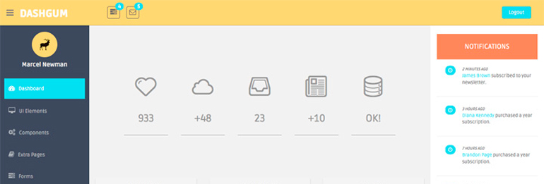

  

# Modulo de Shield

Este modulo es el encargado de defender la data de los usuarios lorem ispon espun sudomantara tantora yaya espun sudomantara tantora yaya espun sudomantara tantora yaya ...

# Documentos

* [Funcionalidades](./documento-funcionalidades/Home)

  * Lista todas las funcionalidades del modulo. Cada funcionalidad debe tener una descripción resumida. Cada funcionalidad se profundizará en los siguientes puntos.

    * Documentacion del Modelo de datos
    * Documentación de Reglas de Negocio
    * Proyectos Asociados

* **Manual de Usuario \(TODO\)**

  * Lista todas las funcionalidades del modulo , cada una con una guía de como usarlas adecuadamente\(screenshot, videoturial, imagenes, etc\).

* [Descripción de la Solución](./descripcion-solucion/Home)

  * Se describe cada una de las funcionalidades de la solución sin entrar mucho al detalle técnico de la implementación

* [Documentación de Desarrollo](./documento-desarrollo/Home)

  * Links a los diversos recursos de la documentacion del **Development Center** necesarios para que cualquier integrante del equipo pueda iniciar el desarrollo, testing y/o despliegue a producción

* [Repositorios de Codigo Fuente](./repositorios-codigo/Home)

  * Lista los repositorios de código usados en esta solución

* [Documentacion de Interfaces de Usuario y urls](./documento-interfaz-usuario-urls/Home)

  * Definicion de las reglas de navegacion de las interfaces de usuario o User interface flow diagram para que cualquier miembro del equipo pueda saber con que urls o paginas del sistema por ambiente.

* [Documentacion del Modelo de datos](./documento-modelo-datos/Home)

  * Por cada **funcionalidad** descrita en el primer punto se documentara:
    * Diagrama de Tablas implicadas en la funcionalidad.
    * Descripcion funcional de cada tabla   

* [Documentación de Recursos Requeridos](./documento-recursos-requeridos/Home)

  * Lista todos los recursos internos y externos que son requeridos por el proyecto por cada funcionalidad : cron linux, ftp, sftp, apis internos, apis externos, base de datos, etc    

* [Documentación de Configuraciones](./documento-configuraciones/Home)

  * Lista todos las configuraciones internas y externas que son requeridas por el proyecto: Roles, Usuarios, Permisos,configuraciones google, configuraciones facebook, analytics,renovación de cuentas, etc             

* [Documentación de Reglas de Negocio\(By Coordinador\)](./images/business_rule_template.png)

  * MUY IMPORTANTE
  * Documentación funcional creada por los coordinadores
  * Por cada **funcionalidad** descrita en el primer punto se listan todas las reglas de negocio. El formato sera un excel con 2 columnas:
    * nombre\_regla
    * descripcion\_regla.
  * Esto sería el punto de partida para aclarar controversias  o dudas como : "Si el promedio ponderado es menor a 15, no debe egresar o si ???"

* **Proyectos Asociados\(By Coordinador\)**

  * Documentación funcional creada por los coordinadores
    * Documento Funcional
    * Diagrama de Flujo
    * Prototipos
    * Actas

# Colaboradores

# Colaboradores

* Phillip "Phil" Coulson  \(Phillip.Coulson@shield.com\)

