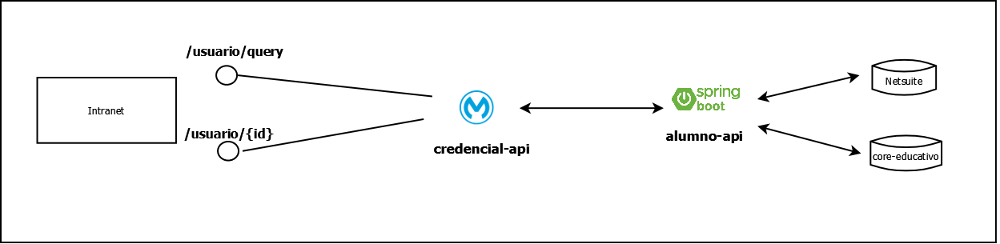

# Descripción de la solución

## Funcionalidades

## Olvido de contraseña

**Paso 1**

Cuando el alumno entra a la pagina de logueo intranet y da click en "olvido su contraseña", se abre un miniformulario donde se ingresa su correo de ingreso, luego se invoca al endpoint credential-api/usuario/codigo/generar, enviandole este correo.

El endpoint **credential-api/usuario/codigo/generar** se encarga de consultar el correo alterno usando el endpoint alumno-api/v1/erp el cual retorna los datos básicos del usuario, entre ellos el primer correo alternativo (validar https://bitbucket.org/utecsup/documentacion-rest-api-reference/wiki/alumno-api/erp-alumno/consultarAlumnoByCodigoAlumno).

Si se encuentra el correo alternativo, se procede a generar el codigo de validacion temporal (algoritmo a buscar input: correo).

Finalmente este endpoint envía un correo al primer correo alterno, el cual contiene el código y el link a la pagina de verificación.

**Paso 2**

Cuando el alumno accede a la URL del correo, se abre una pagina similar a la del cambio de contraseña, en vez de contraseña actual, aparece el codigo de validacion. 

**Paso 3**

Cuando el alumno ingresa el codigo de validacion y su nueva contraseña, se llama al endpoint **credential-api/usuario(PUT)** enviandole el usuario, codigo de validacion, la nueva contraseña y un codigo de operacion para cambio de contraseña en caso de olvido. Este endpoint valida la relacion entre el codigo y el correo, y envia la informacion al LDAP usando un cliente desarrollado. El LDAP retorna un codigo o mensaje de respuesta al alumno en caso de exito o error.

## Cambio de contraseña

Cuando el alumno ingresa a la intranet, en la opción cambio de contraseña, el usuario ingresa su contraseña actual y su nueva contraseña. Luego, se llama al endpoint **credential-api/usuario(PUT)** enviandole el usuario, la contraseña actual, la nueva contraseña y un codigo de operacion para cambio de contraseña en caso de cambio voluntario. Este endpoint valida la contraseña actual, y envia la informacion al LDAP usando un cliente desarrollado. El LDAP retorna un codigo o mensaje de respuesta al alumno en caso de exito o error.

## Búsqueda de alumno

**Paso 1**
El administrador de contraseñas ingresa a la pantalla de Busqueda del alumno, ingresa los filtros de codigo y/o nombre del alumno (que incluso se puede dejar en blanco). Esta acción llamará al endpoint **credential-api/usuario/query** enviando el codigo y/o nombre del alumno para obtener la lista de alumnos registrados en el core-educativo. 

**Paso 2**
En la lista obtenida, el administrador puede escoger un alumno para obtener su detalle, esto llamará al endpoint **credential-api/usuario/{id}** para obtener los datos especificos del alumno, incluyendo sus correos alternativos desde Netsuite.

## Edición de alumno

Al obtener el alumno a cambiar su correo alternativo, el administrador de contraseñas selecciona el correo alternativo para editar. Cuando confirma la operación, se invoca al endpoint **credential-api/usuario(PUT)** enviando el usuario, correo alternativo  y un codigo de operacion para edicion de correo alternativo hacia Netsuite.

# Colaboradores

*  Ingrid Mendoza (imendoza@utec.edu.pe)
