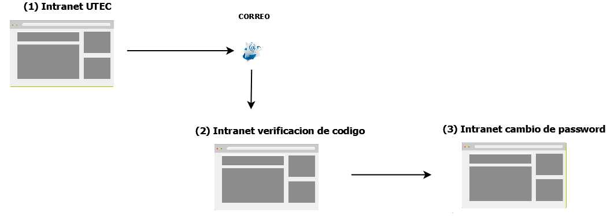
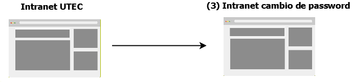

# Diagrama de Flujo de las interfaces de usuario

Este módulo cuenta con cuatro operaciones.

# Funcionalidades

- **Olvido de contraseña**

- **Cambio de contraseña**

- **Busqueda de alumno**

- **Edición de alumno**

# Nota : Las imagenes que contiene un número , indican que tienen una url que puede ser accedida por el usuario

## Leyenda de urls
Id		  |Local		  | QA	         	| PROD 			|
------------- | ------------------- | ------------- | -------------
(01)  |  https://localhost:8080				|  https://qasweb.utec.edu.pe				| https://www.utec.edu.pe
(02)  |  https://localhost:8080/simulador				|  https://qasweb.utec.edu.pe/simulador				| https://www.utec.edu.pe/simulador

# Colaboradores
* Ingrid Mendoza (imendoza@utec.edu.pe)
