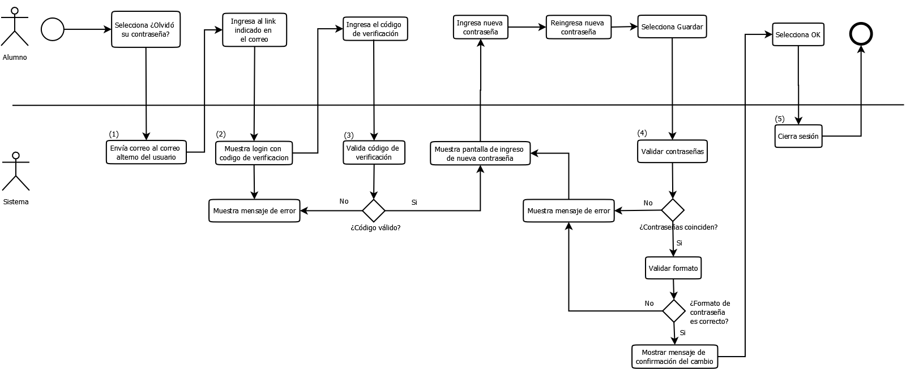
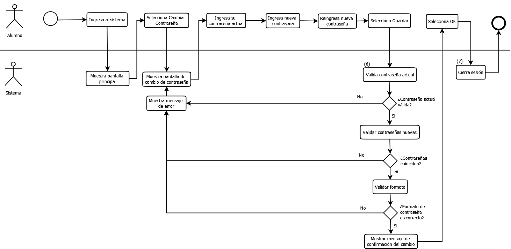
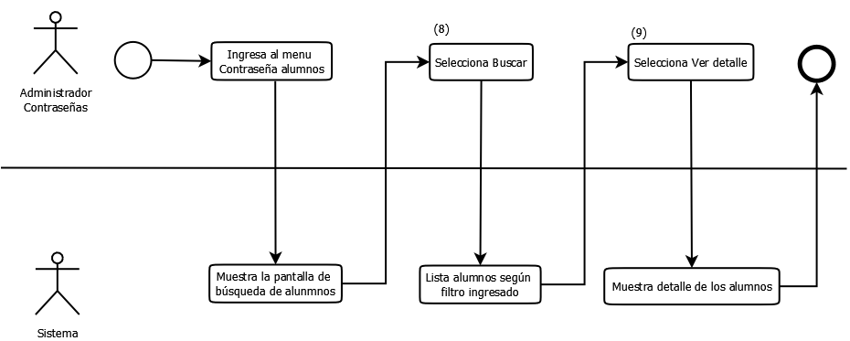
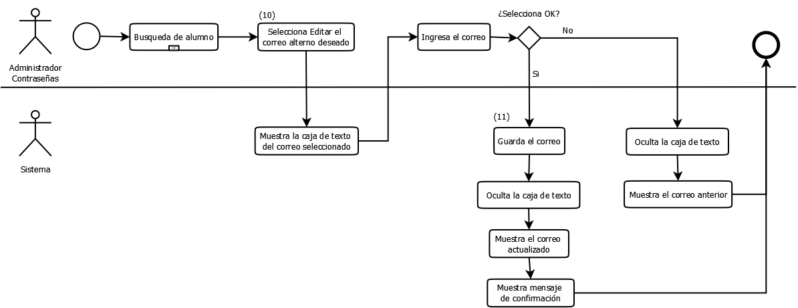

# Diagrama de Flujo de las interfaces de usuario

Este módulo cuenta con cuatro operaciones.

## Operaciones
### Olvido de contraseña

### Cambio de contraseña

### Búsqueda de alumno

### Edición de alumno

## Leyenda de urls
Id		  |Local		  | QA	         	| PROD
------------- | ------------------- | -------------
(01)  |  https://localhost:8080/alumno-seguridad-mule/enviarCorreo				|  https://qasweb.utec.edu.pe/alumno-seguridad-mule/enviarCorreo				| https://www.utec.edu.pe/alumno-seguridad-mule/enviarCorreo
(02)  |  https://localhost:8080/alumno-seguridad-mule/abrirOlvidoContrasenaCambio				|  https://qasweb.utec.edu.pe/alumno-seguridad-mule/abrirOlvidoContrasenaCambio				| https://www.utec.edu.pe/alumno-seguridad-mule/abrirOlvidoContrasenaCambio
(03)  |  https://localhost:8080/alumno-seguridad-mule/validarCodigoActivacion				|  https://qasweb.utec.edu.pe/alumno-seguridad-mule/validarCodigoActivacion				| https://www.utec.edu.pe/alumno-seguridad-mule/validarCodigoActivacion
(04)  |  https://localhost:8080/alumno-seguridad-mule/validarContrasenaNuevaOlvido				|  https://qasweb.utec.edu.pe/alumno-seguridad-mule/validarContrasenaNuevaOlvido				| https://www.utec.edu.pe/alumno-seguridad-mule/validarContrasenaNuevaOlvido
(05)  |  https://localhost:8080/alumno-seguridad-mule/cerrarSesionOlvido				|  https://qasweb.utec.edu.pe/alumno-seguridad-mule/cerrarSesionOlvido				| https://www.utec.edu.pe/alumno-seguridad-mule/cerrarSesionOlvido
(06)  |  https://localhost:8080/alumno-seguridad-mule/validarContrasenaNuevaCambio				|  https://qasweb.utec.edu.pe/alumno-seguridad-mule/validarContrasenaNuevaCambio				| https://www.utec.edu.pe/alumno-seguridad-mule/validarContrasenaNuevaCambio
(07)  |  https://localhost:8080/alumno-seguridad-mule/cerrarSesionCambio				|  https://qasweb.utec.edu.pe/alumno-seguridad-mule/cerrarSesionCambio				| https://www.utec.edu.pe/alumno-seguridad-mule/cerrarSesionCambio
(08)  |  https://localhost:8080/alumno-seguridad-mule/buscarAlumno				|  https://qasweb.utec.edu.pe/alumno-seguridad-mule/buscarAlumno				| https://www.utec.edu.pe/alumno-seguridad-mule/buscarAlumno
(09)  |  https://localhost:8080/alumno-seguridad-mule/verDetalleAlumno				|  https://qasweb.utec.edu.pe/alumno-seguridad-mule/verDetalleAlumno				| https://www.utec.edu.pe/alumno-seguridad-mule/verDetalleAlumno
(10)  |  https://localhost:8080/alumno-seguridad-mule/obtenerCorreoAlternoAlumno				|  https://qasweb.utec.edu.pe/alumno-seguridad-mule/obtenerCorreoAlternoAlumno				| https://www.utec.edu.pe/alumno-seguridad-mule/obtenerCorreoAlternoAlumno
(11)  |  https://localhost:8080/alumno-seguridad-mule/guardarCorreoAlternoAlumno				|  https://qasweb.utec.edu.pe/alumno-seguridad-mule/guardarCorreoAlternoAlumno				| https://www.utec.edu.pe/alumno-seguridad-mule/guardarCorreoAlternoAlumno

# Colaboradores
* Ingrid Mendoza (imendoza@utec.edu.pe)
